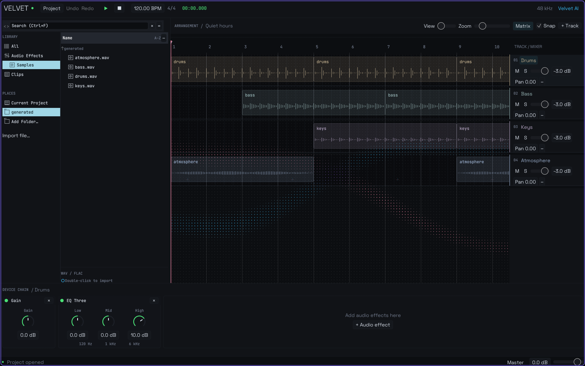
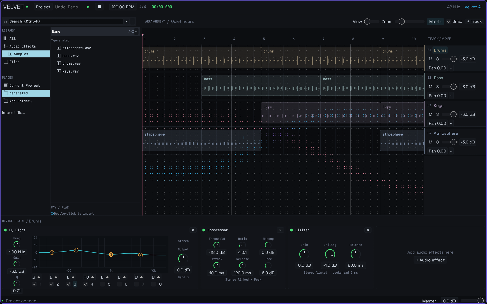

# Velvet

An open-source, AI-native digital audio workstation written in Rust. Experimental / pre-alpha.

Velvet has a native Arrangement View, a CLI and optional OpenAI control. All three issue validated commands against the same project model. The application works without an API key.

The desktop uses an obsidian palette, translucent clips and hairline borders. **Matrix** offers two background presets and an **Enabled** toggle. **Fluid Grid**, the default, uses a rigid 10 px dot matrix with slowly evolving, domain-warped 2D noise contours. Separate cyan and dusty-pink streams modulate tiny dot size and opacity over a faint cool-gray matrix. Hovering gently brightens nearby dots, including the pale background grid. The matrix follows horizontal zoom/pan, vertical scrolling and individual track heights. BPM subtly influences movement speed, and the first beat of each 4/4 bar adds a brief, soft brightness pulse during playback. **Crossing Waves** preserves the original cyan/rose crossing pattern and cursor interaction. The background redraws on a 16 ms schedule while audio processing runs independently. JetBrains Mono and Space Grotesk are bundled locally, with their SIL Open Font License notices in `crates/app/assets/fonts`.

`cargo run -p velvet-app --example matrix_profile` measures the matrix's CPU preparation and tessellation at 1920×1080, including cursor interaction. It does not measure GPU rendering or display refresh.

The original product specification is preserved in [SPEC.md](SPEC.md). This repository implements a small first usable version; the limitations below distinguish it from the complete product vision.

## Run

Install a stable Rust toolchain. Windows requires the MSVC C++ build tools and Windows SDK. On Debian/Ubuntu, install the audio and window development packages:

```bash
sudo apt-get install build-essential pkg-config libasound2-dev libx11-dev libxkbcommon-dev libwayland-dev libgl1-mesa-dev
```

```bash
cargo build --workspace --locked
cargo run -p velvet-app
```

Open a project folder at launch:

```bash
cargo run -p velvet-app -- examples/demo
```

The included `Quiet hours` demo contains four locally synthesized audio tracks. Its WAVs are project-owned and its paths are relative. Recreate it in a new folder with:

```bash
cargo run -p velvet-audio --example create_demo -- examples/my-demo
```



## Desktop workflow

- Create, open and save projects from the Project menu. Save chooses a project folder.
- Add tracks; import a WAV/FLAC or drop a single file on an arrangement lane. External files are referenced in their original location.
- Select a clip; drag it to move, drag either edge to trim, or edit its beat, source offset and duration numerically. Snap uses quarter-beat increments.
- Change volume, stereo balance, mute and solo in the fixed track strip on the right. The track menu supports rename, color and delete; these controls stay visible while scrolling the timeline.
- The two-column browser has a search field (`Ctrl+F`), Library/Places navigation and a **Name** tree with cyan selection. **Add Folder…** remembers your samples folder across launches. Folders appear first, followed by WAV/FLAC files sorted by name; click a disclosure arrow to expand in place, or double-click a folder to open it. Back/Forward, the parent arrow and the Places shortcut navigate folders; **Refresh files** reloads their contents. Search filters file names in the current folder and expanded branches, and filters built-in effects by name or description. **Current Project** shows the project's audio separately. Single-click selects a file; double-click imports at the current transport position.
- Click the ruler or arrangement grid to mark a playback start point. Space starts from that marker; pressing it again stops and returns there. The marker stays visible during playback and follows the same beat when changing tempo. The play button behaves the same; the square transport button stops and resets the marker to zero.
- Enable **Metronome** next to BPM to hear the project tempo during playback. The click follows the transport and loop range, accents the first beat of each 4/4 bar and updates when BPM changes. Pausing, stopping or reaching the end of the song silences it. Click again to disable it; it is a monitoring setting and is excluded from WAV exports.
- Select a clip and press **Ctrl+L** (or click **Loop**) to loop its arrangement range; repeat to disable. The cyan ruler bracket marks the range and follows clip moves, trims and tempo changes. Space starts at the loop's beginning. Looping is a playback setting for the current session, and export still renders the whole arrangement.
- Navigate like Ableton: **Ctrl+wheel** or **+ / −** zoom horizontally, **Alt+wheel** changes the height of the lane under the pointer, **Shift+wheel** scrolls horizontally, and two-finger trackpad scrolling moves in both axes. **Ctrl+Alt+drag** pans the arrangement. Track controls stay fixed horizontally.
- Add Gain, EQ Eight, Compressor or Limiter from **Effects** or **+ Audio effect** in the compact horizontal chain. Knobs drag to adjust, Shift provides finer control, double-click restores defaults, and numeric fields allow precise entry. Device parameters, order and undo/redo work during playback and persist in the project. EQ Three remains available for existing projects.
- Click an effect to select it: its header and border turn cyan, while hover gives a softer highlight. Drag its header before or after another device; the cyan insertion line marks where it will land. **Backspace** or **Delete** removes the selected effect. Reordering and deletion support undo/redo on track and master chains.
- EQ Eight has eight switchable bands: drag numbered points to change frequency and gain, select a band to adjust frequency/gain/Q at the left, and use its bottom dropdown to choose Bell, Low cut, High cut, Low shelf, High shelf or Notch. The graph shows the actual filter response; the right control changes output gain.
- Compressor provides threshold, ratio, attack, release, soft knee and makeup gain. Limiter provides input gain, a sample-peak ceiling and release, with a fixed 5 ms lookahead compensated by the offline renderer. Both use linked stereo detection.
- Click **Master** at the bottom right to select the master chain. Put Limiter last there to limit the full mix, after master volume; track devices run before their track faders. Master devices process left to right before the final output clamp.
- Export a stereo 24-bit WAV from Project → Export WAV. Master level affects playback and export.
- Missing media remains in the arrangement; select the clip and choose Locate missing to relink it. Missing audible media plays as silence and prevents export.

Shortcuts: `Ctrl+N` new, `Ctrl+O` open, `Ctrl+S` save, `Ctrl+Z` undo, `Ctrl+Shift+Z` redo, `Ctrl+L` loop selected clip, `Backspace` / `Delete` remove selected effect or clip, `Space` play/return to marker. Typing into a field suppresses editing shortcuts.



## CLI

After building, the CLI executable is `target/debug/velvet` (`velvet.exe` on Windows). Install it on your PATH with `cargo install --path crates/cli --locked` if desired.

```bash
velvet new song
velvet --project song track add --name "Vocals"
velvet --project song track list
# Substitute the printed stable track ID:
velvet --project song clip import --track track_ID /absolute/path/vocal.wav
velvet --project song track volume track_ID -3
velvet --project song track pan track_ID -0.2
velvet --project song track mute track_ID true
velvet --project song device add track_ID builtin.eq
velvet --project song device add master builtin.limiter
velvet --project song inspect
velvet --project song undo
velvet --project song redo
velvet --project song render song/renders/mix.wav
velvet --project song play --seek 2
```

One-shot editing commands save automatically. Normal saving never collects or duplicates external media. Undo/redo history across CLI invocations lives in a separate `.velvet-history.json`; it is ignored if the YAML was edited outside that history. GUI history lasts for its current session. Both retain up to 100 edits and use the same command implementation.

`velvet play` holds the output stream until Enter is pressed. Use `velvet shell` for persistent play/pause/stop/seek control in one process:

```json
{"op":"play"}
{"op":"seek","seconds":4}
{"op":"pause"}
{"op":"stop"}
```

The shell also accepts `inspect`, `undo`, `redo`, `quit`, and other serialized commands. `velvet command '<JSON>'` exposes the command layer for scripts. Separate CLI processes do not remotely control an already-open GUI; close one before editing with the other.

## Optional AI

Set your own key in the environment before starting the GUI or CLI. Never put it in a project or tracked file.

PowerShell:

```powershell
$env:OPENAI_API_KEY = 'your-key'
$env:VELVET_AI_MODEL = 'gpt-4.1-mini' # optional
cargo run -p velvet-app -- examples/demo
```

Linux:

```bash
export OPENAI_API_KEY='your-key'
export VELVET_AI_MODEL='gpt-4.1-mini' # optional
cargo run -p velvet-cli -- --project examples/demo ask "lower the bass by 3 dB"
```

Velvet uses the [OpenAI Responses API function-calling protocol](https://developers.openai.com/api/docs/guides/function-calling). Tools inspect projects, list/create/rename/delete tracks, change mixer values, move/trim clips, edit built-in devices, save and control transport. Tool names use underscores for API compatibility. The model cannot run code, access arbitrary files, import media or rewrite YAML directly.

Only prompts, project metadata and tool results are sent; audio samples and API keys are never included in project data. Requests use `store: false`. Track names and source paths are part of metadata sent for inspection. Calls use your OpenAI account and can incur API charges. Set `VELVET_AI_MODEL` to choose another model supporting Responses function tools.

AI operations appear in the same undo history and are reported in the panel. A network failure after a successful edit leaves the edit visible and undoable. AI edits preserve playback; explicit transport tools still play, pause, stop or seek. The collapsible AI panel starts closed to leave room for the arrangement. Project controls are temporarily disabled during imports and AI requests to avoid concurrent edits; live audio updates run separately and leave editing available. Live API behavior has not been verified with a paid request; the tool adapter is tested locally.

## Architecture

```text
GUI / CLI / AI → Command → validated Project + history
                              ├→ atomic YAML persistence
                              └→ worker decoding / DSP / mix → CPAL output
```

- `core`: schema version 1, stable IDs, validation, commands, runtime transport, snapshot history and atomic persistence.
- `audio`: WAV/FLAC decoding, sample-rate conversion, track buses, stereo balance, Gain, legacy three-band EQ, eight-band parametric EQ, stereo compressor, lookahead limiter, master effects, WAV export and CPAL playback.
- `ai`: bounded Responses tool loop with a validated command adapter; key and model are environment-only.
- `cli`: file-based editing and an interactive transport shell.
- `app`: custom egui/eframe theme, arrangement widgets, waveforms, file dialogs, device rack and AI control panel.

The audio callback reads an immutable stereo mix plus atomic transport values. A bounded `rtrb` queue hands off new mixes at callback boundaries, with a short crossfade; another queue returns old buffers for destruction outside the callback. It performs no file I/O, networking, serialization, GUI work, blocking locks or heap allocation. YAML saves and WAV exports use synchronized same-directory temporary files and atomic replacement. Export refuses to overwrite project source audio.

The [visual architecture review](docs/architecture-review.html) compares three potential improvements: playback coordination, device parameter definitions and browser state ownership. Download and open the HTML file in a browser to view the diagrams.

EQ Eight's DSP and plotted response share RBJ biquad coefficients from the [W3C Audio EQ Cookbook](https://www.w3.org/TR/audio-eq-cookbook/). Saved format-1 projects without `master_devices` load with an empty master chain. CLI and AI device tools accept `master` as the target as well as track IDs.

## Current limits

- Playback pre-renders the arrangement in a background worker. GUI edits, undo and redo rebuild the mix while the previous mix keeps playing, then swap it without restarting or seeking. Rapid edits coalesce and stale worker results are discarded. Updates take the render time plus a short debounce; large projects need incremental DSP for lower control latency. This remains a bounded pre-alpha approach, not a streaming audio graph.
- WAV/FLAC sources must be mono or stereo, at most 30 minutes each. Arrangements are limited to 30 minutes and 64 million stereo output frames. Sample-rate conversion is linear interpolation; master peaks above unity are hard-clipped after the master chain. EQ frequencies are constrained below Nyquist at the render rate. EQ Three retains its original broad bands at 120 Hz, 1 kHz and 6 kHz.
- Limiter controls sample peaks, without oversampled true-peak detection. Compressor is a feed-forward peak design; external sidechain, RMS detection and spectral analysis are future work. The EQ graph is a frequency response, not a live spectrum analyzer. These effects use the existing background mix renderer for both playback and export.
- Drop/import one file at a time. Clips move within their existing track. Trimming beyond the source produces silence; no warping, stretching, recording, MIDI, automation or external plugins.
- Save to another folder references existing project-owned audio externally and resets GUI history; it does not collect media. Collection, automatic search and autosave are future work.
- Playback uses the system default output device. Device selection, configurable buffers, meters and audio-input recording are future work. CPAL uses WASAPI on Windows and ALSA on Linux in this build.
- Windows compilation, DSP, persistence, CLI workflows, GUI rendering and a silent hardware-output transport test are checked locally. Linux is covered by the supplied CI configuration but has not been run in this environment. The hardware test is ignored by default so CI does not require an audio device.
- Avoid concurrent writers. There is no file lock or remote GUI/CLI session protocol yet.

## Development

```bash
cargo fmt --all -- --check
cargo clippy --workspace --all-targets --locked -- -D warnings
cargo test --workspace --locked
# Optional silent test against a real default output device:
cargo test -p velvet-audio hardware_transport -- --ignored
cargo test -p velvet-app hardware_gui_edit -- --ignored
```

The tests cover command rejection without partial changes, undo/redo, schema/path validation, atomic overwrite, missing sources, non-destructive trim, mixing/DSP, export and an end-to-end CLI workflow. CI runs on Windows and Ubuntu.

Local validation on 2026-10-04: formatting and Clippy pass. Two desktop tests currently fail: browser navigation history includes the locally saved samples folder, and the matrix first-beat pulse exceeds its sparse-contour assertion. The latter also fails at the previous animation speed. Hardware tests remain opt-in.

License: TBD, as in the specification. No open-source license grant is selected yet.
