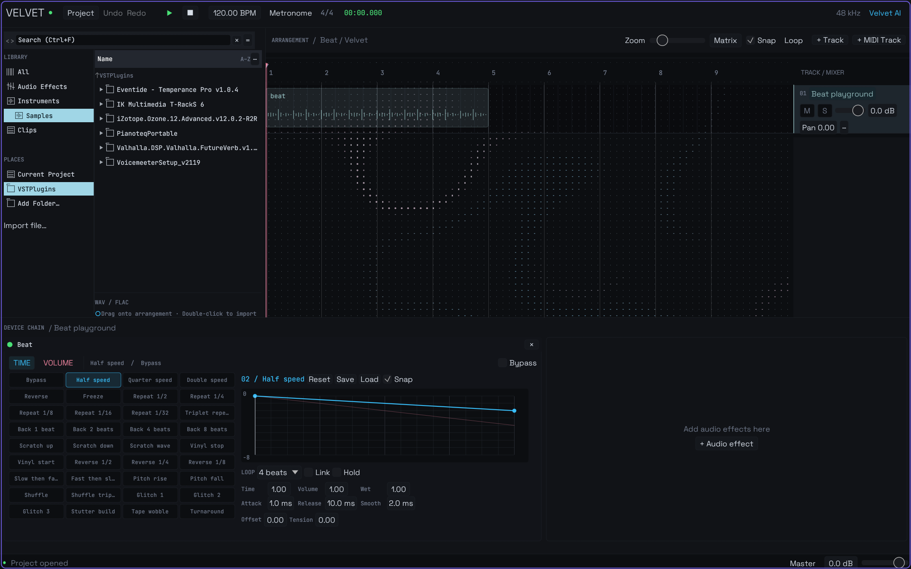

# Beat / Gross Beat reference

Beat is Velvet's native time and volume shaping effect (`builtin.beat`). Add it
from **Audio Effects** or **+ Audio effect** to an audio/MIDI track or the master.
It processes the preceding device's stereo output, before the following device;
the same background renderer supplies playback and WAV export. No external plugin
installation is required. Device order, parameters and edited slots use the
existing project commands, validation, save/load and undo/redo paths.



## Reference analysis

Image-Line documents Gross Beat as a two-bar rolling audio buffer with 36 time
and 36 volume envelope slots. Time envelopes specify an offset from the incoming
audio: horizontal segments play normally, downward slopes slow the playback,
steeper slopes reverse it and discontinuities jump through the buffer. Volume
envelopes independently multiply the signal. Its Time control scales the offset;
Volume mixes the envelope with unity gain. Attack, release and tension shape gain.

Sources:

- [Gross Beat manual](https://www.image-line.com/fl-studio-learning/fl-studio-online-manual/html/plugins/Gross%20Beat.htm)
- [Time settings](https://www.image-line.com/fl-studio-learning/fl-studio-online-manual/html/plugins/GrossBeat_TimeSettings.htm)
- [Volume settings](https://www.image-line.com/fl-studio-learning-content/fl-studio-online-manual/html/plugins/GrossBeat_VolumeSettings.htm)

## Velvet implementation

- 36 time presets and 36 volume presets, separately selectable; Link selects the
  corresponding slot in both banks. Factory envelopes are generated locally.
- Half/quarter/double speed, reverse, freeze, repeats, delays, scratches, vinyl
  start/stop, shuffle, glitch, gates, pumping, fades and tremolo.
- Editable points with linear, hold and smooth interpolation. Right-click empty
  graph space to add a point; drag to move; Alt-click an interior point to delete.
  Right-click a point to select its outgoing curve. Snap uses 1/16 of the cycle;
  Alt bypasses snapping while dragging. Reset restores the selected factory slot.
- **Save/Load** exports/imports the selected envelope as JSON. Imports are bounded
  and validated before project mutation. A dot marks an edited slot. All edited
  banks are saved in the project, including inactive slots.
- Separate Time and Volume amounts, final Wet mix, attack/release, tension,
  discontinuity crossfades, manual delay offset and bypass.
- Cycles are aligned to global song position and BPM, with lengths from 1/4 to
  8 beats. A two-bar history at 4/4 limits delay to eight beats. A reverse preset
  can start with silence until the requested history exists, like causal playback
  in the reference. At extended cycle lengths, offsets still stop at eight beats.
- Hold captures the first complete cycle and repeats it through the arrangement.
  This follows Velvet's existing background rendering model.

## Fidelity boundaries

These are independently authored equivalents, not Image-Line factory preset
files. Gross Beat `.fst` files are not imported. Exact factory-bank coverage and
sample-for-sample equivalence have not been verified against a running Gross Beat.
Playback uses stereo linear interpolation and short crossfades; proprietary
resampling, every original curve mode, DC removal and smoothing are not replicated.

Velvet currently renders edits into background mixes. It does not provide Gross
Beat's sample-accurate live MIDI slot triggering, queued trigger/position sync,
key-held or one-shot slot behavior. Hold repeats the first captured cycle rather
than live last/next-bar capture. There are no inactive UI controls claiming these
features.

## Verification and demo

```powershell
cargo test -p velvet-core -p velvet-audio -p velvet-app beat
cargo run -p velvet-audio --example create_beat_demo -- target/beat-demo
cargo run -p velvet-app -- target/beat-demo
```

The demo creates a synthetic beat, a project with Half speed selected and a
processed `half-speed.wav`. Choose a fresh directory for a new demo.
Tests cover all 72 factory envelopes, invalid edits, persistence/history, tempo,
causality, repeat/hold, stereo, exact dry bypass, rack layout/preset selection,
chain order and WAV export.
